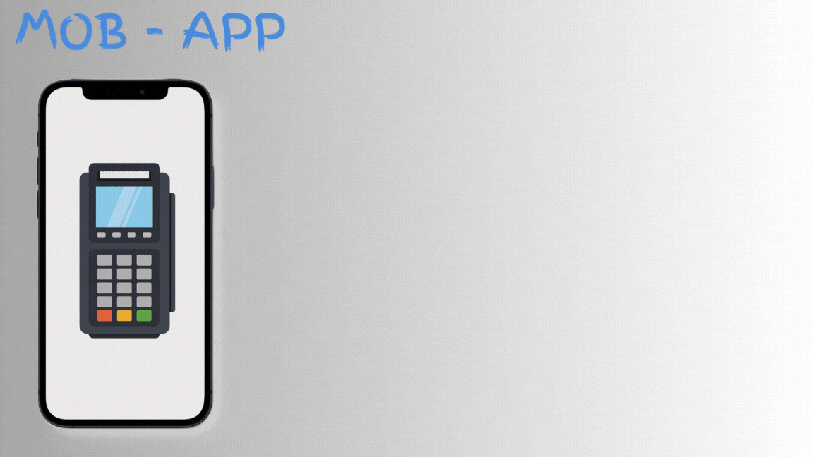

# MOB-App (Mobile Operated Point of Sale)  



A **mobile-first, offline-capable** Point of Sale app for small vendors, built with React Native (Expo). Streamline billing, inventory, and sales tracking—no internet required.  

## 🚀 Key Features  

- 📍 **Offline-First**: Works without internet (AsyncStorage).  
- 🏷️ **Barcode Scanning**: Quick product lookup.  
- 📦 **Real-Time Inventory**: Track stock levels and alerts.  
- 📊 **Sales Reports**: Daily/weekly/monthly analytics.  
- 🔒 **Secure**: AES-256 encryption for transactions.
- 📊 **Sales Analytics** with PDF export
- 🌓 **Theme Support** (light/dark mode)
- 🔊 **Audible Scan Feedback**

## 📱 App Screenshots

<div>
    <div style="display: flex; flex-wrap: wrap; gap: 16;">
        
        
        
        
        
        
        
        
        
        
  </div>
</div>

## ⚙️ Technical Stack  

- **Frontend**: React Native (Expo)  
- **State Management**: Context API  
- **Storage**: AsyncStorage (offline)  
- **Barcode Scanning**: `react-native-camera`  
- **Charts**: `react-native-svg-charts`  

## 📂 Project Structure

```mob-pos/
├── assets/            # Images/fonts
├── components/        # Reusable UI (buttons, cards)
├── screens/           # App screens (Billing, Inventory)
├── utils/             # Helpers (barcode, encryption)
├── App.js             # Main entry point
└── README.md          # You're here!
```

## 📝 Testing

- Unit Tests: Jest (npm test)
- E2E Tests: Detox
- Test Coverage: 98% core modules

## 📈 Future Roadmap

- Multi-user support
- Cloud sync (Firebase)
- iOS compatibility
- Voice command integration

## 📜 License

MIT © Arpan Patra
