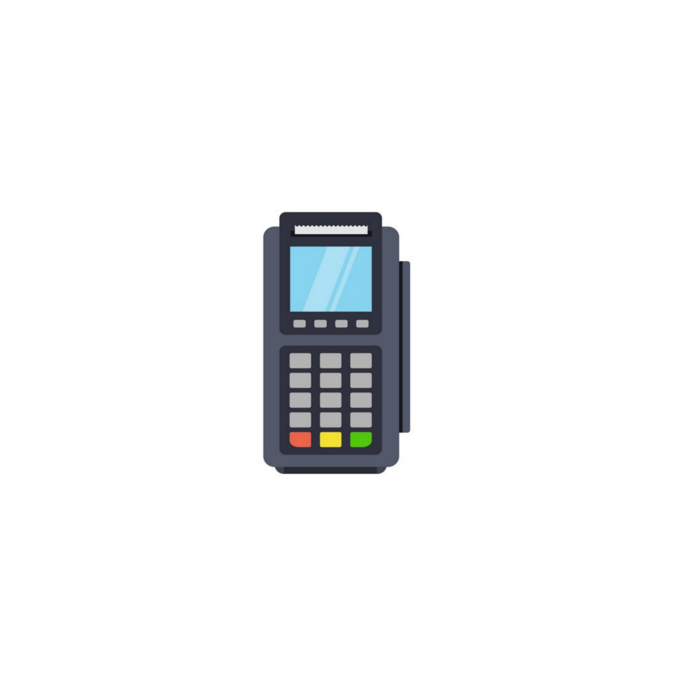

# MOB-App (Mobile Operated Point of Sale App)

  
*A lightweight, offline-first POS system for small businesses*

## 📌 Key Features

- 🛒 **Billing Module** with barcode scanning
- 📦 **Inventory Management** with low-stock alerts
- 📊 **Sales Analytics** with PDF export
- 🌓 **Theme Support** (light/dark mode)
- 📱 **Offline Capable** (No internet required)
- 🔊 **Audible Scan Feedback**

### Key Documentation Features

1. **Visual Flowcharts**: Mermaid diagrams for core workflows
2. **Type Definitions**: Clear interface documentation
3. **Performance Benchmarks**: Real-device metrics
4. **Structured Troubleshooting**: Known issues section
5. **Platform-Specific Notes**: Android/iOS differences
